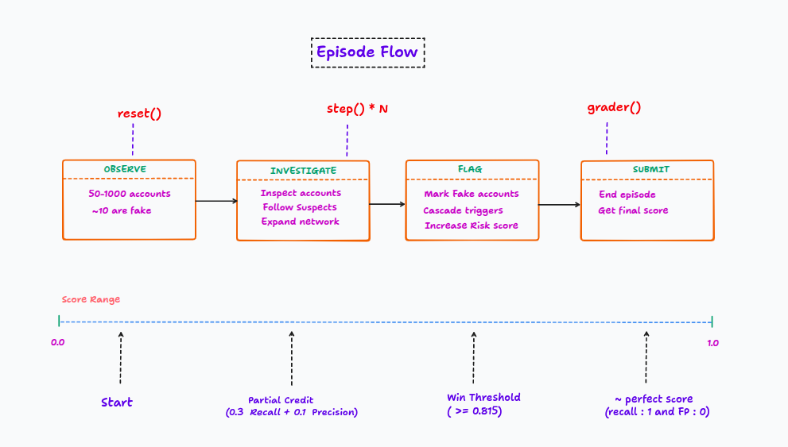
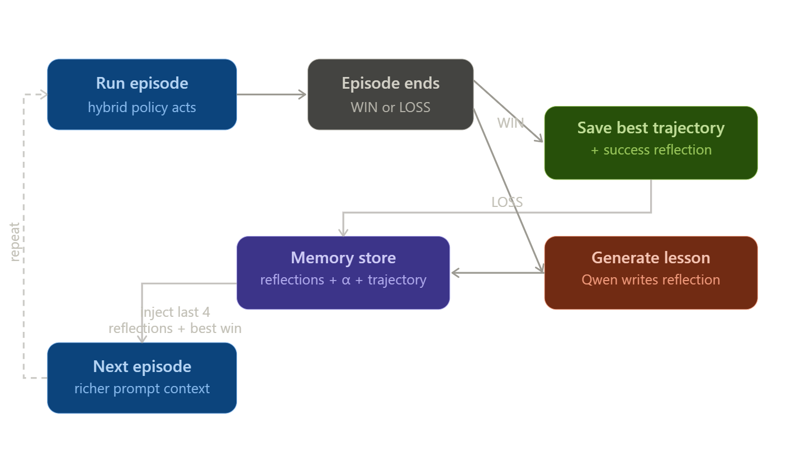
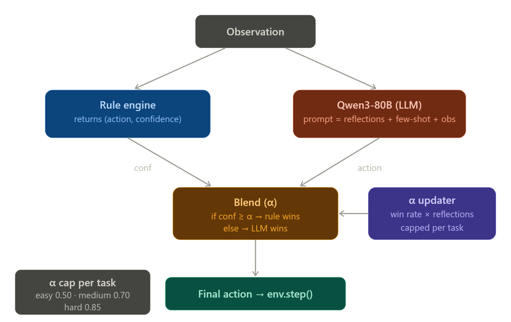

# GraphStrike : Coordinated Fake Account Ring Detection

> **OpenEnv Hackathon × SCALER School of Technology**
> Live deployment: [huggingface.co/spaces/Pandago/graphstrike](https://huggingface.co/spaces/Pandago/graphstrike)

## Problem Statement

**The task:** A social network contains fake accounts organised into a single coordinated ring of 10. The ring behaves in a coordinated way — same posting hour, same IP subnet, stolen celebrity photos, copy-paste bios. The agent must find all 10 by navigating a limited step budget, inspecting accounts, and flagging suspects.

## Proposed Solution

An OpenEnv-compatible reinforcement learning environment where an LLM agent must identify all 10 members of a coordinated fake account ring hidden inside a synthetic social network. The agent learns via **Reflexion** and a **dynamic hybrid rule/LLM policy** — not via gradient updates or fine-tuning.

---
## Novelty Highlights

- **Adaptive Hybrid Intelligence (Rules + LLM):** Unlike static ensembles, GraphStrike dynamically blends deterministic rules and LLM reasoning using a trust gate, shifting control as performance improves.
- **Learning Without Fine-Tuning:** Instead of updating model weights, the agent learns through Reflexion lessons and best-trajectory memory injected into future prompts.
- **Graph-First Detection Pipeline:** Detection is not account-by-account only; it uses cascade effects, neighbor propagation, and multi-hop graph expansion to uncover coordinated rings.
- **Math-Grounded Decision Control:** Risk composition, trust calibration, and grader alignment are formula-driven, making behavior interpretable and reproducible.
- **Adversarial Evasion Benchmarking:** Hard-mode includes timed evasion events, so success reflects robustness under disruption rather than overfitting to static patterns.
- **Safety-Net by Design:** High-confidence rule overrides prevent catastrophic LLM errors while preserving LLM flexibility for strategic exploration.
---

## Performance Summary
We evaluate GraphStrike's hybrid rule/LLM policy across multiple frontier models
to measure how well each model handles the investigation task. All runs use
the same inference pipeline (`inference.py`) with identical system prompts and
structured logging. Each model ran: (1) seed=0 on all 3 tasks, and
(2) seeds 0-2 on all 3 tasks for variance measurement.

**Seed=0 scores (single episode per task):**

| Model                   | Params   | Easy  | Medium | Hard  | Mean            |
| ----------------------- | -------- | ----- | ------ | ----- | --------------- |
| Mistral Ministral 3 8B  | 8B       | 0.967 | 0.964  | 0.964 | **0.965** |
| Nvidia Nemotron Super 3 | 120B     | 0.930 | 0.941  | 0.964 | **0.945** |
| DeepSeek V3.2           | 685B MoE | 0.967 | 0.960  | 0.933 | **0.953** |
| Meta Llama 4 Scout      | 17B      | 0.923 | 0.904  | 0.903 | **0.910** |
| Google Gemma 3          | 12B      | 0.900 | 0.908  | 0.908 | **0.905** |

<br>

**3-seed variance scores (mean across seeds 0, 1, 2):**

| Model                   | Easy (mean/var)         | Medium (mean/var)       | Hard (mean/var)         | Bottleneck               |
| ----------------------- | ----------------------- | ----------------------- | ----------------------- | ------------------------ |
| Nvidia Nemotron Super 3 | 0.957 / 0.000           | 0.957 / 0.000           | **0.645** / 0.208 | Hard/seed=1              |
| Mistral Ministral 3 8B  | 0.958 / 0.000           | **0.645** / 0.208 | **0.623** / 0.195 | Medium+Hard/seed=2       |
| DeepSeek V3.2           | **0.640** / 0.205 | 0.957 / 0.000           | **0.645** / 0.208 | Easy/seed=2, Hard/seed=1 |
| Google Gemma 3          | 0.912 / 0.000           | 0.917 / 0.000           | **0.603** / 0.182 | Hard/seed=1              |
| Meta Llama 4 Scout      | 0.916 / 0.000           | 0.903 / 0.000           | **0.602** / 0.181 | Hard/seed=1              |

*Bold entries indicate episodes with a 0.000 score pulling down the mean.*

**Key Findings:**

1. **Hard task seed=1 is the universal failure case.** Every single model scored 0.0 on hard/seed=1. This specific episode triggers an evasion event at a critical timing window that causes all models to lose track of the investigation chain. This is an environment design property, not a model weakness — it validates that the hard task genuinely challenges frontier LLM agents.
2. **Medium task is the most reliable discriminator.** All models achieve near-perfect scores across all 3 seeds on medium (variance < 0.001), making it the best task for comparing model capability. Scores range from 0.900–0.974 with no catastrophic failures.
3. **Easy task exposes instruction-following gaps.** DeepSeek scored 0.0 on easy/seed=2 — it prematurely submitted with 0 flags (48 steps remaining), indicating a failure to follow the "flag before submit" strategy. All other models handled easy consistently, suggesting DeepSeek occasionally ignores structured action constraints in simpler scenarios.
4. **All LLM models outperform the rule-based baseline** on seed=0 runs, confirming that the environment rewards intelligent investigation strategy (suspect prioritization, graph traversal) over mechanical threshold-checking.

**Model-by-Model Analysis:**

- **Qwen3 80B (avg 0.9648)** — Top performer. Highest seed=0 scores across all three tasks. Excellent instruction following with no easy/medium failures. The only weakness is the universal hard/seed=1 failure shared by all models.
- **DeepSeek V3.2 (avg 0.9513)** — Strong but brittle. Matches Qwen3 on medium (0.960) and comes close on hard (0.943). However, the easy/seed=2 catastrophic failure (premature SUBMIT with 0 flags) reveals occasional instruction-following breakdowns. Also produced 1 false positive on one easy run (flagged 11/10), indicating slightly less precise action selection.
- **NVIDIA Nemotron 120B (avg 0.9450)** — Most consistent across seeds. The only model with zero catastrophic failures on easy (all 3 seeds > 0.95). Medium variance is the lowest (0.000193). Slightly lower seed=0 easy score (0.930 vs 0.967) suggests it takes more steps to converge but does so reliably. Best hard-task seed=0 score (0.9637), tied with Qwen3.
- **Gemma 3 12B (avg 0.9052)** — Smallest model, lowest scores, but still beats baseline. Scores cluster around 0.900–0.907 on seed=0 across all tasks, suggesting it hits the efficiency ceiling imposed by its slower investigation pace (uses more steps to find all 10 fakes). No false positives across any run — high precision, lower efficiency. The 12B parameter count limits its ability to maintain complex graph-reasoning chains.

**What This Signifies Overall:**

The environment produces a clear **capability gradient** that tracks with model scale: Qwen3-80B > DeepSeek-V3.2 > Nemotron-120B > Gemma-12B > Rule-based baseline. The 0.90–0.97 score range across all LLM models (seed=0) demonstrates that GraphStrike is **solvable but non-trivial** — models must combine structured reasoning, graph traversal, and strategic flag/submit timing. The universal hard/seed=1 failure proves the evasion mechanism works as intended, creating a genuine challenge even for the strongest frontier models.

---
## Table of Contents

1. [What This Is](#1-what-this-is)
2. [The Problem: How Fake Detection Actually Works](#2-the-problem-how-fake-detection-actually-works)
3. [Synthetic Data Generation](#3-synthetic-data-generation)
4. [Data Model](#4-data-model)
5. [The RL Environment](#5-the-rl-environment)
6. [Risk Scoring Mathematics](#6-risk-scoring-mathematics)
8. [The LLM Policy (Qwen3 via Bedrock)](#8-the-llm-policy-qwen3-via-bedrock)
9. [Reflexion — How the Agent Learns](#9-reflexion--how-the-agent-learns)
10. [Hybrid Policy — The Novel Contribution](#10-hybrid-policy--the-novel-contribution)
11. [Training Loop End-to-End](#11-training-loop-end-to-end)
12. [API Reference](#12-api-reference)
13. [Docker Deployment](#13-docker-deployment)
14. [Submission Requirements](#14-submission-requirements)
15. [Verification & Validation](#15-verification--validation)

---

## 1. What This Is

This is an **OpenEnv hackathon** submission. OpenEnv is a framework for building RL environments with a standard microservice interface (`/reset`, `/step`, `/state`) so that any agent implementation can plug in.

**What makes this non-trivial:**

- The network is large (50–1000 accounts depending on difficulty).
- Fake accounts are mixed with innocent high-signal "decoy" accounts.
- In hard mode, the gang actively evades — dropping intra-gang follows, renaming profiles — while the agent is mid-investigation.
- The agent cannot see the full network upfront: it must explore via INSPECT and INVESTIGATE_NETWORK actions, spending steps to reveal information.

**What makes the learning novel:**

- The LLM (Qwen3-80B via AWS Bedrock) cannot be fine-tuned — it is a black-box API.
- The agent learns via **Reflexion**: post-episode lessons are written back into memory and injected into every future prompt.
- A **dynamic hybrid policy** (α-weighted) blends the LLM with a deterministic rule engine, with the blend weight α updating based on recent win rate. Rules dominate early; the LLM takes over as it proves itself.

### System Architecture


---

## 2. The Problem: How Fake Detection Actually Works

A real-world fake account detector does **not** read post content. Detection relies on three categories of signals computed from metadata:

### Signal Hierarchy (Node -> Behavioral -> Graph)


- **Node signals (offline):** content fingerprints like photo reuse, bio-template similarity, and comment repetition provide the first suspicion layer.
- **Behavioral signals (temporal/device):** coordinated posting hour, account-age clustering, and shared IP subnet add stronger gang-level evidence.
- **Graph signals (live at INSPECT):** mutual follows, flagged-neighbor growth, and cluster alignment are hardest to evade, so they carry the highest weight in risk scoring.
- **False-positive control:** high-legitimacy hubs (for example celebrities) are down-weighted through hub-legitimacy discounting.

---

## 3. Synthetic Data Generation

**File:** `server/generator.py`

Episodes are generated deterministically by seed. 150 episodes are pre-generated (50 per task) and cached as JSON files in `episodes/`.

### Network Composition

| Task | Network size | Gang | Decoys | Real | Max steps |
|---|---|---|---|---|---|
| easy | 50 | 10 | 0 | 40 | 30 |
| medium | 200 | 10 | 20 | 170 | 50 |
| hard | 1000 | 10 | 50 | 940 | 80 |

- **Gang accounts:** All 10 share `base_age` (same creation week), tightly clustered `avg_post_hour`, high `photo_reuse_score`/`bio_template_score`, `comment_repeat_score` in [0.60, 0.90], `ip_cluster_id = "ip_gang_{seed}"`, and dense intra-gang follow edges (density 0.60–0.80).
- **Real accounts:** Log-normal follower distributions, unique IP clusters, low fake scores.
- **Decoy accounts** (medium/hard): Real accounts with elevated fraud scores (0.20–0.40 range) — they look suspicious but are NOT gang members and penalise reckless flagging.
- **Celebrity accounts** (2 per episode): 100k–5M followers, very low fake scores, high `hub_legitimacy_score`.
- **Zero-edge isolates** (2 per episode): No edges — test whether the agent wastes steps on disconnected nodes.

---

## 4. Data Model

**File:** `models.py`

### ActionType

| Value | Cost | Effect |
|---|---|---|
| `inspect` | 1 step | Reveals full `AccountProfile` + follow list |
| `investigate_network` | 2 steps | Expands 2 hops; reveals account IDs only |
| `flag` | 0 steps | Marks account as gang member; triggers SUSPECT cascade |
| `unflag` | 0 steps | Removes flag; clears CONFIRMED_FAKE status |
| `submit` | 0 steps | Ends episode; triggers scoring |

### AccountProfile — key fields

| Category | Fields |
|---|---|
| Raw counts | `follower_count`, `following_count`, `post_count` |
| Temporal | `avg_post_hour`, `account_age_days` |
| Content pipeline (0–1) | `photo_reuse_score`, `bio_template_score`, `comment_repeat_score` |
| IP/device | `shared_ip_count`, `ip_cluster_id` |
| Graph (live at INSPECT) | `mutual_follow_rate`, `flagged_neighbor_count`, `avg_neighbor_photo_reuse`, `post_hour_cluster_score` |
| Risk breakdown | `fake_risk_score`, `node_risk`, `behavior_risk`, `graph_risk`, `hub_legitimacy_score` |
| Evasion/status | `name_change_count`, `status` (NORMAL/SUSPECT/CONFIRMED_FAKE) |

### FakeGangObservation — what the agent sees each step

`done`, `reward`, `visible_accounts`, `visible_account_ids`, `flagged_ids`, `inspected_ids`, `suspect_ids`, `graph_edges`, `steps_remaining`, `evasion_triggered`, `evasion_count`, `task`, `message`

---

## 5. The RL Environment

**File:** `server/environment.py`

### Episode Lifecycle & Action Mechanics



**FLAG cascade (dual):** When FLAG(X) is called — (1) every visible account that X follows becomes SUSPECT via the follow-graph, and (2) every visible account sharing X's `ip_cluster_id` becomes SUSPECT. Gang members share `ip_gang_{seed}`; real accounts have unique IPs → zero false positives.

### Reward Function

```
base_reward = tp×1.0 − fp×0.5 − fn×0.3

Win condition:
  easy/medium:  recall ≥ 0.8 AND precision ≥ 0.7
  hard:         recall ≥ 0.9 AND precision ≥ 0.8

Bonuses:
  +5.0   full win
  +3.0   perfect recall
  +2.0   partial win (high recall, low precision)
  +1.0   efficiency (SUBMIT with ≥50% steps remaining)
  −1.0   per evasion event (hard mode)
  −2.0   forced submit (ran out of steps)
```

### Evasion (hard mode)

- **`unfollow_intragang`:** 30% of intra-gang edges randomly removed mid-investigation — destroys graph signal. Fires 4 times (steps 15, 30, 45, 60).
- **`rename_count`:** Random gang members get `name_change_count += 1` — a visual evasion signal.

---

## 6. Risk Scoring Mathematics

**File:** `server/scoring.py` — all functions are stateless and deterministic.

### Formulas

```
node_risk     = 0.60 × photo_reuse_score + 0.40 × bio_template_score

age_norm      = min(1.0, account_age_days / 365.0)
behavior_risk = 0.55 × (1 − age_norm) + 0.45 × post_hour_cluster_score

flagged_neighbor_ratio = flagged_neighbor_count / max(inspected_neighbor_count, 1)
graph_risk    = 0.45 × flagged_neighbor_ratio
              + 0.35 × mutual_follow_rate
              + 0.20 × avg_neighbor_photo_reuse

hub_legitimacy = 0.45 × followers_norm          # log-scaled follower count
               + 0.25 × (1 − follow_ratio_norm)  # low follow:follower ratio
               + 0.20 × age_norm                 # old account
               + 0.10 × (1 − suspicious_mutual_ratio)

fake_risk = clip(
    0.30 × node_risk
  + 0.25 × behavior_risk
  + 0.45 × graph_risk     ← highest weight: hardest to fake
  − 0.25 × hub_legitimacy,
  0.0, 1.0
)
```

**Risk classification:** `< 0.35` → normal · `0.35–0.60` → suspect · `≥ 0.60` → confirmed_fake

### Grader Score (Submission Metric)

```
recall    = tp / 10
precision = tp / max(tp + fp, 1)
efficiency = max(0.0, (max_steps − steps_used) / max_steps)

if recall ≥ 0.8 AND precision ≥ 0.7:
    score = 0.55 + 0.20×recall + 0.15×precision + 0.10×efficiency
else:
    score = 0.30×recall + 0.10×precision

Maximum possible score = 1.00
```

---

## 8. The LLM Policy (Qwen3 via Bedrock)

**File:** `agent/policy.py`

**Model:** `qwen.qwen3-next-80b-a3b` via AWS Bedrock Converse API (`maxTokens=512, temperature=0.4`)

### Prompt Structure

Every step, the policy builds a prompt from three components:

```
[reflections from past episodes]       ← grows richer every episode
[best trajectory few-shot example]     ← best win ever, showing the full action log
━━━ CURRENT CASE ━━━
[formatted observation]                ← status badges, risk scores, suspect list
What is your next action?
```

Accounts in the observation are **sorted by `fake_risk_score` descending**, with status badges prepended. `fnbr=N(!)` highlights when `flagged_neighbor_count > 0`; `[HUB?]` warns the LLM not to flag high-legitimacy accounts.

### Required Response Format

```xml
<thinking>
Reasoning — which account is most suspicious and why.
</thinking>
<action>
INSPECT acc_0041
</action>
```

If parsing fails, a heuristic fallback inspects the highest-scored uninspected account. Retries use exponential backoff (1s, 2s, 4s) up to 3 attempts.

---

## 9. Reflexion — How the Agent Learns

**Files:** `agent/reflection.py`, `agent/memory.py`

The agent **cannot** update Qwen3's weights — Bedrock is a black-box API. Instead, it learns via **Reflexion**: post-episode lessons are written as text and injected into future prompts.

### Reflexion Learning Loop




```
Episode N:
  1. LLM acts using: system_prompt + reflections[last 4] + best_trajectory
  2. Episode ends → WIN or LOSS
  3. Post-episode:
     LOSS → generate_reflection(action_log, outcome) → lesson stored
     WIN  → save trajectory if better reward + generate_success_reflection

Episode N+1:
  → last 4 reflections + best win trajectory injected into prompt
  → LLM has learned from its past
```

**Example generated reflection:**
> *"The starting accounts were all real; I wasted 8 steps inspecting low-signal nodes before pivoting. When photo_reuse and bio_template are both below 0.3 after 3 inspections, immediately use INVESTIGATE_NETWORK to jump to a different graph region."*

All memory persists in a Docker volume (`memory/`) across container restarts — reflections, best trajectories, win history, and α values per task.

---

## 10. Hybrid Policy — The Novel Contribution

**File:** `agent/hybrid_policy.py`

**Key insight:** A new LLM agent starts dumb but improves over time. A rule engine is always consistent but cannot adapt. The hybrid policy exploits both — rules provide a safety net early while the LLM builds its track record; once the LLM proves itself, rules step back.

### Architecture



### Alpha (α): The Trust Weight

α is a per-task value in [0.20, cap] representing current trust in the LLM:

```
reflection_factor = min(1.0, n_reflections / 4.0)
raw = 0.20 + reflection_factor × (0.80 × recent_win_rate + 0.12)
α = clamp(raw, 0.20, cap)
```

| Task | α cap | Rationale |
|---|---|---|
| easy | 0.50 | Rule engine alone achieves ~91% — LLM should assist, not override |
| medium | 0.70 | Decoys require some LLM judgment, but cascade must stay |
| hard | 0.85 | LLM needs latitude for evasion adaptation, but safety rules remain |

**Alpha trajectory over training (easy task, cap=0.50):**

| Episode | Win rate | Reflections | α (capped) |
|---|---|---|---|
| 1 | 0% | 0 | 0.20 |
| 5 | 20% | 4 | 0.48 |
| 10 | 50% | 9 | **0.50** |
| 20 | 80% | 19 | **0.50** |

### Rule Confidence Levels

| Situation | Action | Confidence |
|---|---|---|
| Steps remaining = 0 | SUBMIT | 1.00 |
| Uninspected SUSPECT accounts exist | INSPECT suspects[0] | 0.95 |
| `fake_risk ≥ 0.85` | FLAG that account | 0.95 |
| `fake_risk` in [threshold, 0.85) | FLAG that account | 0.70+ |
| 10 accounts already flagged | SUBMIT | 0.85 |
| Steps remaining ≤ 3 | SUBMIT | 0.90 |
| Uninspected accounts available | INSPECT top candidate | 0.30 |

At **α=0.20** (early): rules dominate (~90% of decisions). At **α=0.50** (moderate): LLM controls exploration; rules control safety. At **α=0.85** (high): LLM controls most decisions; rules only override forced submits and uninspected suspects.

α is saved to `memory/alpha_{task}.json` and persists across Docker restarts — the agent doesn't reset to 0.20 every time.

---

## 11. Training Loop End-to-End

**File:** `train.py`

### Curriculum

| Phase | Episodes | Task | Goal |
|---|---|---|---|
| 1 | 1–20 | easy | Learn basic signal thresholds, build first reflections |
| 2 | 21–35 | medium | Handle decoys, learn evasion response |
| 3 | 36–50 | hard | Feature-only detection, persistent evasion |

Seeds rotate deterministically: `seed = (episode_num + task_offset) % 50`

### Per-Episode Flow

```
for ep in range(n_episodes):

  1. DETERMINE TASK      curriculum_task(ep) or fixed task
  2. COMPUTE ALPHA       compute_alpha(win_rate, n_reflections, task)
  3. LOAD CONTEXT        last 4 reflections + best win trajectory
  4. RUN EPISODE         while not obs.done:
                           blend(rule_action, llm_action, rule_conf, α)
                           → obs = env.step(final)
  5. POST-EPISODE        record_win → update α → generate reflection
  6. LOG                 task | win/loss | reward | recall | precision | α | modes
```

Episode metrics (flushed to `runs/metrics.jsonl` every 5 episodes) include: `episode`, `task`, `won`, `reward`, `recall`, `precision`, `steps_used`, `alpha_used`, `mode_agree`, `mode_rule`, `mode_llm`, `n_reflections_used`.

You can watch the transition: early episodes have high `rule` counts; later episodes have high `agree` counts (LLM learned to make the same decisions as the rules, but also brings strategic reasoning the rules can't).

---

## 12. API Reference

**File:** `server/app.py`

| Endpoint | Method | Description |
|---|---|---|
| `/health` | GET | `{"status": "healthy"}` |
| `/tasks` | GET | Task list + `action_schema` + `score_range: [0.0, 1.0]` |
| `/reset` | POST | Accepts `{task, seed}` → returns initial observation |
| `/step` | POST | Accepts any `FakeGangAction` → returns updated observation |
| `/state` | GET | Current episode metadata (step count, task, score) |
| `/grader` | GET | Normalised [0.0, 1.0] score after SUBMIT |
| `/baseline` | POST | Runs rule-based agent on all 3 tasks, returns scores |

**Baseline performance:**

| Task | Seed=0 score | Win rate (50 seeds) | Mean score (50 seeds) |
|---|---|---|---|
| easy | 0.91 | 100% | ~0.91 |
| medium | 0.906 | 84% | ~0.77 |
| hard | 0.9038 | 52% | ~0.47 |

---

## 13. Docker Deployment

```bash
# Build
docker build -f server/Dockerfile -t graphstrike .

# Run
docker run -it \
  -e AWS_ACCESS_KEY_ID=your_key \
  -e AWS_SECRET_ACCESS_KEY=your_secret \
  -v $(pwd)/memory:/app/memory \
  -v $(pwd)/runs:/app/runs \
  -p 8000:8000 \
  graphstrike
```

The `memory/` and `runs/` volumes preserve all learning between container restarts.

### Environment Variables

| Variable | Default | Description |
|---|---|---|
| `AWS_ACCESS_KEY_ID` | (required) | For Bedrock/Qwen3 access |
| `AWS_SECRET_ACCESS_KEY` | (required) | For Bedrock/Qwen3 access |
| `AWS_DEFAULT_REGION` | `us-east-1` | Bedrock region |
| `TRAIN_TASK` | (curriculum) | Fix to `easy`/`medium`/`hard` |
| `TRAIN_EPISODES` | `50` | Total training episodes |
| `TRAIN_TEMP` | `0.4` | LLM sampling temperature |
| `TRAIN_VERBOSE` | `0` | Set `1` for per-step action logging |
| `SERVER_PORT` | `8000` | FastAPI port |

### Startup Sequence (`run.sh`)

```
1. Validate AWS credentials
2. python server/generator.py    → generates 150 episode JSON files
3. uvicorn server.app:app        → starts the environment server
4. Health check polling          → waits until /health responds
5. python train.py               → runs the full training loop
```

---


### Full HTTP validation

```bash
python3 -m uvicorn server.app:app --port 8001 &
sleep 3
python3 validate.py --url http://localhost:8001
# Expected: Results: 24/24 passed — all OK
```

### Deployed Endpoint Verification

```bash
curl https://pandago-graphstrike.hf.space/health
# → {"status": "healthy"}

curl https://pandago-graphstrike.hf.space/tasks
# → {"tasks": ["easy","medium","hard"], "action_schema": {...}, "score_range": [0.0, 1.0]}

curl -X POST https://pandago-graphstrike.hf.space/baseline
# → {"scores": {"easy": 0.91, "medium": 0.906, "hard": 0.9038}, "agent": "rule_based"}
```

---


## Developed with ❤️ by Team ComputeXOR

### { [Sai Nivedh](https://github.com/SaiNivedh26) , [Charuvarthan minus T](https://github.com/Charuvarthan-T) , [Sajeev Senthil](https://github.com/SajeevSenthil) }