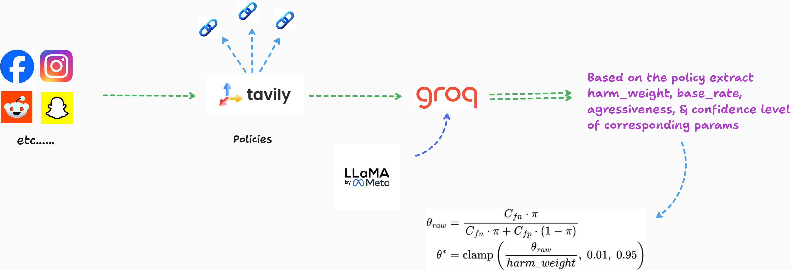
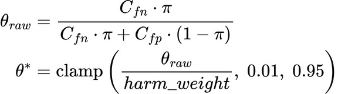
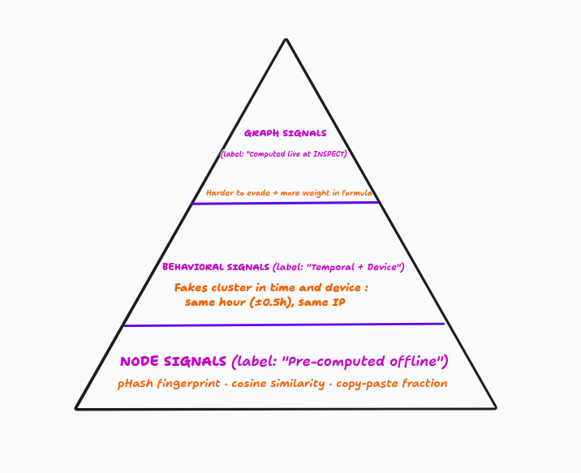
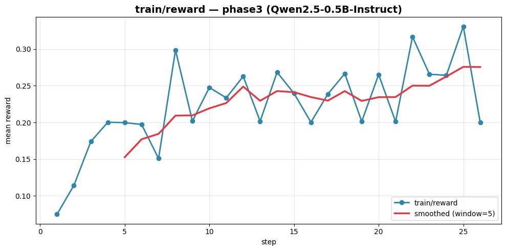
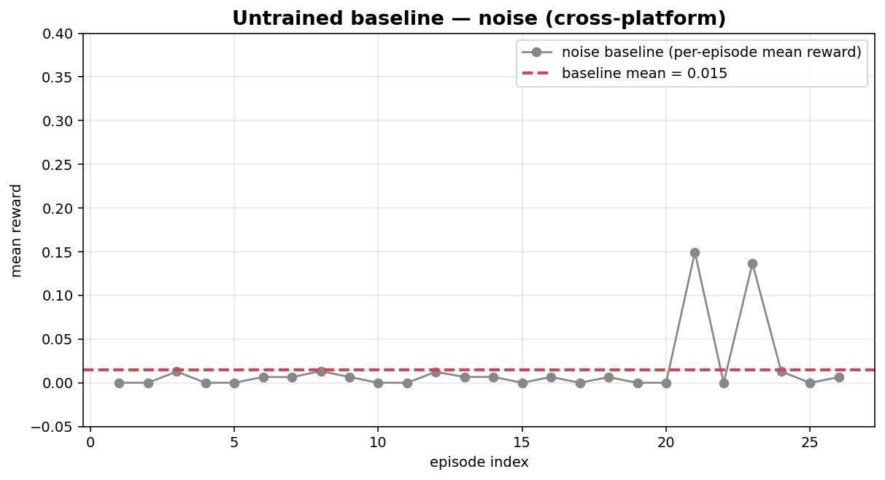

<p align="center">
  
</p>

<p align="center">
  <b>An OpenEnv-compatible RL environment for platform-adaptive fake-account detection.</b><br>
  An LLM agent inspects a synthetic social graph, gathers evidence under a step budget,
  and flags coordinated inauthentic accounts under a <em>platform-specific</em> enforcement threshold.
</p>

<p align="center">
  <a href="https://huggingface.co/spaces/Pandago/training-space"></a>
  <a href="https://huggingface.co/Pandago/graphstrike-grpo-weights"></a>
  <a href="https://github.com/SaiNivedh26/graphstrike"></a>
  
</p>

---

## TL;DR

GraphStrike is designed as a platform-adaptive reinforcement learning system trained using GRPO on structured graph environments.The system introduces dynamic policy compilation, where detection thresholds are derived from real time platform policies rather than being hardcoded.The action space is expanded to include cost-aware investigative tools, enabling the agent to actively gather evidence before making decisions.A hidden-signal architecture forces the model to balance exploration and exploitation by revealing signals only through actions.The model learns a policy-conditioned behavior, where both decision-making and reward signals are aligned with platform-specific thresholds.

**Watch our 2-min Quick video:** [here you go](https://drive.google.com/file/d/11m1slCylVijeorXr95eF_ci94LR9dT5r/view)

**Read our slides :  [here you go](https://canva.link/dqq78p5orsjh39r)**

## Why this environment

Most fake-account detection benchmarks frame the problem as classification: feature vector in, fake/real label out. That misses the structure of the real problem. A real investigator:

1. Cannot see all signals upfront — each costs a tool call.
2. Operates under a **step budget**.
3. Applies **different enforcement thresholds** depending on the platform.
4. Faces **asymmetric costs** — false positives are catastrophic on Instagram, much cheaper on Snapchat.

GraphStrike encodes all four constraints simultaneously. We don't know of another benchmark environment that does.

---

## System Architecture

<p align="center">
  
</p>

The agent talks to the FastAPI environment over an OpenEnv-compatible HTTP API. Episodes are deterministic from a seed; the policy threshold for each platform is precomputed once via the Bayesian policy compiler and frozen into every dataset row.

---

## The Bayesian Policy Compiler

Every platform enforces moderation policy differently. Rather than hardcoding a threshold, we **derive** it from each platform's public transparency reports.

<p align="center">
  
</p>

Per-platform transparency text → LLM extractor (Groq Llama 3.1 8B) → calibrated parameters (`harm_weight`, `base_rate`, `enforcement_aggressiveness` + per-parameter confidences `α/β/γ`) → Bayesian compiler → threshold θ → frozen into every training row.

<p align="center">
  
</p>

**Compiled platform policies:**

| Platform                          |    θ | Primary Signal | FP Penalty | FN Cost  | FP Cost |
| --------------------------------- | ----: | -------------- | ---------: | -------- | ------- |
| Instagram                         | 0.369 | photoreuse     |       0.10 | critical | low     |
| X / Twitter                       | 0.091 | photoreuse     |      ~0.10 | critical | medium  |
| Snapchat                          | 0.025 | biotemplate    |       0.01 | high     | low     |
| **LinkedIn** _(held-out)_ | 0.167 | photoreuse     |       0.10 | high     | medium  |

The same account with `fake_risk=0.20, photo_reuse=0.65` is a clear flag on Snapchat (θ=0.025), but on Instagram (θ=0.369) the agent must verify additional evidence first. **The same observation produces a different correct action depending on platform context.**

---

## Environment Mechanics

### Difficulty Tiers

| Task             |     Network | Gang | Decoys | Step Budget | Evasion              |
| ---------------- | ----------: | ---: | -----: | ----------: | -------------------- |
| **Easy**   |    50 accts |   10 |      0 |          30 | None                 |
| **Medium** |   200 accts |   10 |     20 |          50 | Triggered at step 20 |
| **Hard**   | 1,000 accts |   10 |     50 |          80 | 4 recurring events   |

Decoys are legitimate accounts engineered to look suspicious — they punish agents that flag on surface-level anomaly scores without gathering signal evidence.

### Action Space

| Action                   | Cost | Effect                                                         |
| ------------------------ | ---: | -------------------------------------------------------------- |
| `getpolicy`            |    0 | Returns compiled policy: threshold, primary signal, FP penalty |
| `inspect`              |    1 | Expand visible neighborhood of an account                      |
| `investigate_network`  |    1 | 2-hop graph traversal                                          |
| `reverse_image_search` |    1 | Reveal `photo_reuse_score`                                   |
| `analyze_bio`          |    1 | Reveal `bio_template_score`                                  |
| `check_ip`             |    2 | Reveal `ip_cluster_signal` (higher cost = legal overhead)    |
| `flag` / `unflag`    |    0 | Mark / un-mark account; triggers SUSPECT cascade               |
| `submit`               |    0 | End episode → grader scores                                   |

The step budget is shared across all actions. An agent that calls `check_ip` on every account exhausts its budget before flagging anyone.

### Detection Signals

<p align="center">
  
</p>

Visible by default: `fake_risk_score`, `node_risk`, `behavior_risk`, `graph_risk`, `hub_legitimacy`, `shared_ip_count`. Hidden until reveal-tool: `photo_reuse_score`, `bio_template_score`, `ip_cluster_signal`.

### Risk Score (platform-adaptive)

```
fake_risk = clip(
    w_node × node_risk + w_behavior × behavior_risk + w_graph × graph_risk
  − 0.25 × hub_legitimacy,
    0.0, 1.0)
```

Weights `w_*` are platform-specific — `photoreuse`-primary platforms boost node weight, `ipcluster`-primary platforms boost behavior weight. `hub_legitimacy` subtracts a downward correction so well-connected community hubs aren't flagged just for being well-connected.

---

## Reward Function — Composable Rubrics

We didn't use OpenEnv's `Rubric` class but independently arrived at the same architectural principle. The reward is **three orthogonal components, logged separately to W&B** rather than collapsed into one opaque score.

| Component               | Type                   |        Weight | Measures                                                       |
| ----------------------- | ---------------------- | ------------: | -------------------------------------------------------------- |
| `grader_reward`       | terminal (per episode) | **1.0** | Precision × Recall × Efficiency × PlatformFactor            |
| `format_reward`       | per-turn               | **0.3** | Valid JSON action — structural correctness                    |
| `policy_aware_reward` | per-turn               | **0.2** | Called `getpolicy` first? Used reveal tools before flagging? |

```
# Grader (at submission)
recall = TP / 10;  precision = TP / max(TP+FP, 1)
efficiency = max(0, (max_steps − steps_used) / max_steps)
threshold_factor = 1.0 − θ           # stricter platforms get a precision bonus
if recall ≥ 0.8 and precision ≥ 0.7:
    score = 0.55 + 0.20·recall + 0.15·precision + 0.10·efficiency + 0.05·threshold_factor
else:
    score = 0.30·recall + 0.10·precision

# Per-turn (broadcast for GRPO)
per_turn_reward(t) = grader + clip(step_reward(t) · 0.1, −0.5, 0.5)
```

The `threshold_factor` is the mechanism that rewards platform-appropriate behavior: an agent on Instagram has to be more conservative with flags to compensate for the lower `threshold_factor`.

---

## Training: Cross-Platform GRPO

|                 |                                                                                                           |
| --------------- | --------------------------------------------------------------------------------------------------------- |
| Model           | `Qwen/Qwen2.5-0.5B-Instruct`                                                                            |
| Algorithm       | GRPO (TRL)                                                                                                |
| Train platforms | Instagram + X + Snapchat (shuffled mixture, 360 prompts)                                                  |
| Held-out eval   | LinkedIn (never seen during training)                                                                     |
| Hardware        | T4 GPU (collab full-scale training) / Trial Runs Nvidia A10G via Hf spaces                                |
| W&B run         | `pleasant-water-16` ([report](https://api.wandb.ai/links/sainivedh26-amrita-vishwa-vidyapeetham/sw1rj3tb)) |

### Why the shuffled mixture matters

If we trained on Instagram only, the model would learn to treat the platform parameter θ as a constant. By interleaving platforms within batches, the model **must** read `platform` and `threshold` from every observation to decide correctly — there is no memorizable answer. This is what enables zero-shot LinkedIn transfer.

### Training results

<p align="center">
  <br>
  <em>Trained: ~0.07 → ~0.30+ across 25 GRPO steps</em>
</p>

<p align="center">
  <br>
  <em>Untrained baseline (gibberish actions, JSON parse fails): r_total ≈ 0.0 floor</em>
</p>

**Three phases of the run:**

1. **Steps 1–5 (format learning)** — high gradient norms (19–57), volatile rewards, model rapidly adjusting toward structured JSON.
2. **Steps 6–15 (policy discovery)** — reward stabilizes at 0.20–0.27, GRPO group variance shows real differentiation between trajectories.
3. **Steps 16–25 (consolidation)** — peaks at 0.33; smoothed reward continues rising.

**Held-out LinkedIn:** ~0.92 grader score on medium-task episodes despite zero LinkedIn training data — the model reads `θ=0.167` from the prompt and behaves correctly.

---

## Quick Start

### Option 1 — Use the hosted environment

```bash
# Health check
curl https://pandago-training-space.hf.space/health

# Reset an episode
curl -X POST https://pandago-training-space.hf.space/reset \
  -H 'Content-Type: application/json' \
  -d '{"task":"easy","seed":0,"platform":"Instagram"}'

# Step
curl -X POST https://pandago-training-space.hf.space/step \
  -H 'Content-Type: application/json' \
  -d '{"action":{"action_type":"getpolicy","account_id":null}}'
```

The full OpenAPI schema is at `/docs`. The Gradio playground is at `/`.

### Option 2 — Run locally

```bash
git clone https://github.com/SaiNivedh26/graphstrike
cd graphstrike
pip install -r requirements.txt
python3 -m server.app   # serves on :7860
```

### Option 3 — Reproduce training

Open the Colab notebook (one click → run all):
👉 **[Training Colab — GRPO on shuffled platform mixture](https://colab.research.google.com/drive/10oiBzwDy6ZxwxYqhuVniRuzgG7cnrF2E?usp=sharing)**

---

## References

|                                      |                                                                                                      |
| ------------------------------------ | ---------------------------------------------------------------------------------------------------- |
| 🎬**Demo video**               | [drive.google.com](https://drive.google.com/file/d/11m1slCylVijeorXr95eF_ci94LR9dT5r/view?usp=sharing)  |
| 📊**Slides (5-min explainer)** | [canva.link/dqq78p5orsjh39r](https://canva.link/dqq78p5orsjh39r)                                        |
| 📓**Training Colab**           | [Colab notebook](https://colab.research.google.com/drive/10oiBzwDy6ZxwxYqhuVniRuzgG7cnrF2E?usp=sharing) |
| 🤗**Trained weights**          | [Pandago/graphstrike-grpo-weights](https://huggingface.co/Pandago/graphstrike-grpo-weights/tree/main)   |
| 🤗**Hosted environment**       | [Pandago/graphstrike Space](https://huggingface.co/spaces/Pandago/training-space)                       |
| 📈**W&B Report**               | [pleasant-water-16](https://api.wandb.ai/links/sainivedh26-amrita-vishwa-vidyapeetham/sw1rj3tb)         |
| 💻**Source**                   | [github.com/SaiNivedh26/graphstrike](https://github.com/SaiNivedh26/graphstrike)                        |

---

---


## Developed with ❤️ by Team ComputeXOR

### {

### [Sai Nivedh](https://github.com/SaiNivedh26) ,

### [Charuvarthan](https://github.com/Charuvarthan-T) ,

### [Sajeev](https://github.com/SajeevSenthil)

### }
